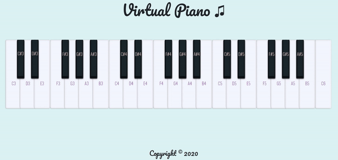

# Piano App

> This is a Javascript application where you can play 🎹 Practice piano on your computer or phone.

## Technologies

- JavaScript ES6
- Bootstrap - version 4.0

## Setup

To run this project install it locally and open index.html live server using for example Visual Studio Code or Atom.

You can use it also here: http://justynagawlik.pl/

