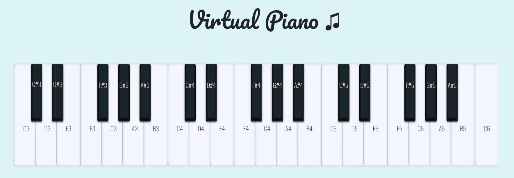

# Piano App

> This is a Javascript application where you can play 🎹 Practice piano on your computer or phone.

## Table of contents

- [Screenshots](#screenshots)
- [Technologies](#technologies)
- [Setup](#setup)
- [Features](#features)

## Screenshots

## Technologies

- JavaScript ES6
- Bootstrap - version 4.0

## Setup

To run this project install it locally and open index.html using your explorer (Google Chrome, Firefox etc.)

Link to application:

## Features

You can practice piano whenever you want and wherever you are.
